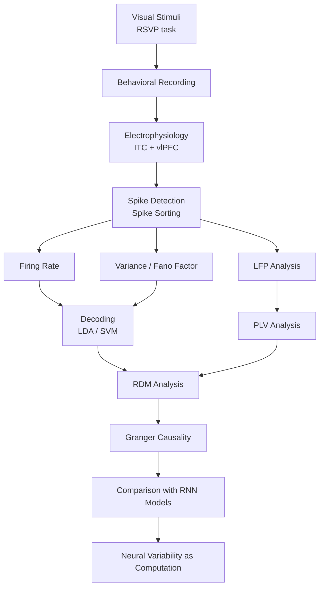

# 🧠 Neural Variability and Visual Coding in Primate Cortex


---

## 📊 GitHub Analytics


---

# 🔬 Abstract

<div align="justify">

What if the brain’s “neural noise” is not noise at all, but a hidden channel of information?

Despite decades of work on sensory coding, the contribution of trial-by-trial neural variability remains unresolved, particularly at the single-neuron level. Classical studies have emphasized firing rates and noise correlations, yet the information content in variability—quantified via the Fano factor (variance-to-mean ratio of spike counts)—has received remarkably little attention.

Here, we directly investigate the role of neural variability dynamic structures in complex stimulus coding across the Inferior Temporal Cortex (ITC) and Ventrolateral Prefrontal Cortex (vlPFC) during visual categorization.

Using simultaneous recordings from ITC and vlPFC in macaques performing a passive RSVP task, we show that variance and the Fano factor encode category-selective information independently of mean firing rate, as confirmed through generalized linear modeling (GLM) that dissociates rate- and variability-based contributions.

Variability-based decoding performs comparably to firing-rate–based classifiers and exhibits structured temporal dynamics characterized by distinct quenching phases across cortical regions and stimulus types.

Anterior ITC neurons display pronounced variability-based selectivity for biologically salient categories such as faces versus artificial objects.

Importantly, both phase-locking value (PLV) and Granger causality analyses reveal a top-down communication channel in which trials with high neural variability exhibit stronger feedback from vlPFC to ITC than low-variability trials—an effect not observed for firing-rate–based classifications.

Finally, Representational Dissimilarity Matrix (RDM) analysis demonstrates that variability-based neural representations are more consistent with recurrent computational models (e.g., CORnet-S) than feedforward architectures, suggesting that variability may support recurrent inference and hierarchical integration.

Together, these findings indicate that neural variability is not stochastic background activity but a structured and behaviorally meaningful dimension of the neural code carrying independent sensory information and participating in feedback-driven recurrent processing underlying complex stimulus coding in ITC and vlPFC.

</div>

---

## 🔑 Keywords

- Neural variability  
- Fano factor  
- Inferior Temporal Cortex (ITC)  
- Ventrolateral Prefrontal Cortex (vlPFC)  
- Visual categorization  
- Recurrent neural networks  
- Granger causality  
- Representational similarity analysis  

---

# 🧠 Experimental Pipeline



---

# 🐒 Subjects and Experimental Design

The study was conducted on three adult male rhesus macaque monkeys (*Macaca mulatta*).

- Monkey J: 10 kg, 7 years old  
- Monkey Z: 12 kg, 14 years old  
- Monkey V: 8.8 kg, 9 years old  

All procedures followed institutional and national ethical guidelines for animal experimentation.

---

# 🧠 Electrophysiological Recordings

Neural activity was simultaneously recorded from:

- Inferior Temporal Cortex (ITC)
- Ventrolateral Prefrontal Cortex (vlPFC)

using extracellular acute recording techniques with tungsten microelectrodes.

### Recording Parameters

- Sampling rate: 40 kHz (30 kHz for Monkey V)
- Spike band: 300–3000 Hz
- LFP band: 0.1–9000 Hz
- Recording system: NikTek Systems
- Amplifier: Resana (Tehran, Iran)

Electrode localization was guided using MRI and CT imaging combined with a 1-mm reference grid.

---

# 👁 Behavioral Task and Stimuli

Monkeys performed a passive fixation RSVP task.

### Stimulus Presentation

- Stimulus duration: 50 ms
- Inter-stimulus interval: 600 ms
- Display: 144 Hz monitor
- Visual angle: 7° × 7°
- Eye tracking: 200 Hz infrared system

### Stimulus Categories

- Faces
- Bodies
- Artificial objects
- Natural objects

Monkey V additionally viewed 500 grayscale natural and artificial object images with matched spatial-frequency statistics using the SHINE toolbox.

---

# 📈 Neural Variability Analysis

To characterize trial-to-trial neural variability, we computed:

- Variance of spike counts
- Fano Factor (FF)

using sliding temporal windows:

- Window size: 50 ms
- Sliding step: 5 ms

A mean-matching procedure was applied across time to remove firing-rate biases from FF estimates.

Analyses were performed across 856 neurons recorded from ITC and vlPFC.

---

# 🤖 Statistical and Decoding Analyses

### Machine Learning

- Support Vector Machine (SVM)
- Linear Discriminant Analysis (LDA)
- Time-Time decoding

### Statistical Modeling

Generalized Linear Models (GLM) were used to dissociate:

- firing rate effects
- neural variability
- stimulus contrast
- illumination effects

### Temporal Statistics

- Cluster-based permutation tests
- Wilcoxon signed-rank tests

were used to evaluate neural onset and peak dynamics.

---

# 🔄 Time-Time Decoding

Cross-temporal decoding analyses were performed to determine whether neural representations remained stable or dynamically evolved over time.

Time-Time decoding matrices were computed independently for:

- firing rate
- neural variance

allowing comparison of temporal generalization structures.

---

# 🔗 Granger Causality Analysis

Granger causality was applied to Representational Dissimilarity Matrix (RDM) time series derived from:

- firing rate
- neural variability

to quantify directional interactions between ITC and vlPFC.

This analysis revealed stronger top-down vlPFC → ITC feedback during high-variability trials.

---

# 🧩 Representational Similarity Analysis (RSA)

Representational Dissimilarity Matrices (RDMs) derived from neural variability were compared against:

- ideal categorical models
- CORnet-S
- AlexNet

using Kendall’s tau correlation.

Results showed stronger correspondence between neural variability representations and recurrent neural network architectures.

---

# 🌐 Phase Locking Value (PLV)

Functional connectivity between ITC and vlPFC was quantified using Phase Locking Value (PLV).

Beta-band PLV (15–30 Hz) analyses revealed stronger synchronization during high-variability trials relative to low-variability conditions.

---

# 🗂 Repository Structure

```bash
SRC/
├── Fano_Factor/
│   ├── Category_based/
│   └── Stimulus_based/
│
├── GLM/
│
├── Information_Theory/
│
├── PSTH/
│
├── LFP/
│   ├── PLV/
│
├── RDM/
│   ├── Granger_Causality/
│   └── Neural_Network_Comparison/
│
└── Machine_Learning/
    ├── LDA/
    ├── SVM/
    └── Time_Time_Decoding/
```

---

# 🔧 Technologies Used

- Python
- MATLAB
- NumPy
- SciPy
- scikit-learn
- MNE-Python
- PsychToolbox

---

# 📚 Scientific Contributions

This work demonstrates that:

- neural variability carries independent sensory information
- variability dynamics differ across cortical regions
- top-down recurrent processing modulates neural variability
- recurrent architectures better capture neural representational geometry than feedforward models

---

# 👨‍🔬 Citation

If you use this repository, please cite the associated publication.

---

# ⭐ Acknowledgment

This repository was developed for computational neuroscience research focused on neural variability, visual categorization, recurrent processing, and cortical dynamics in behaving primates.
